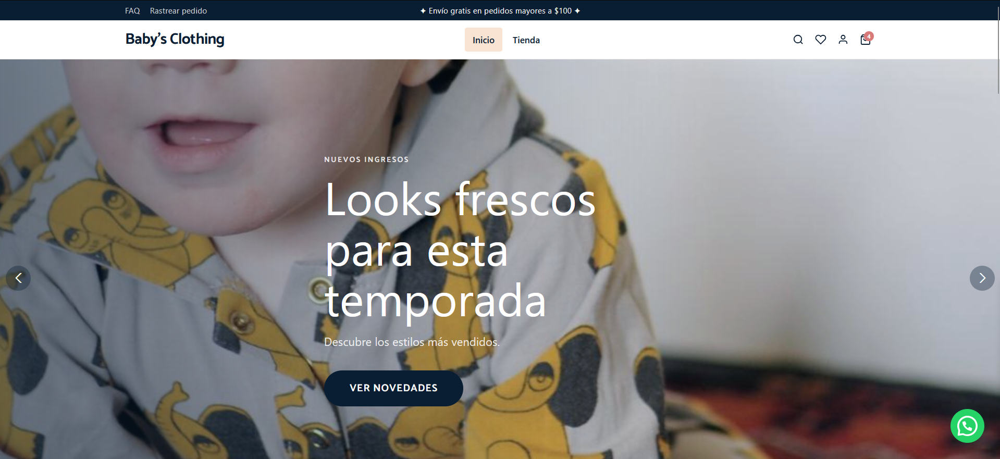
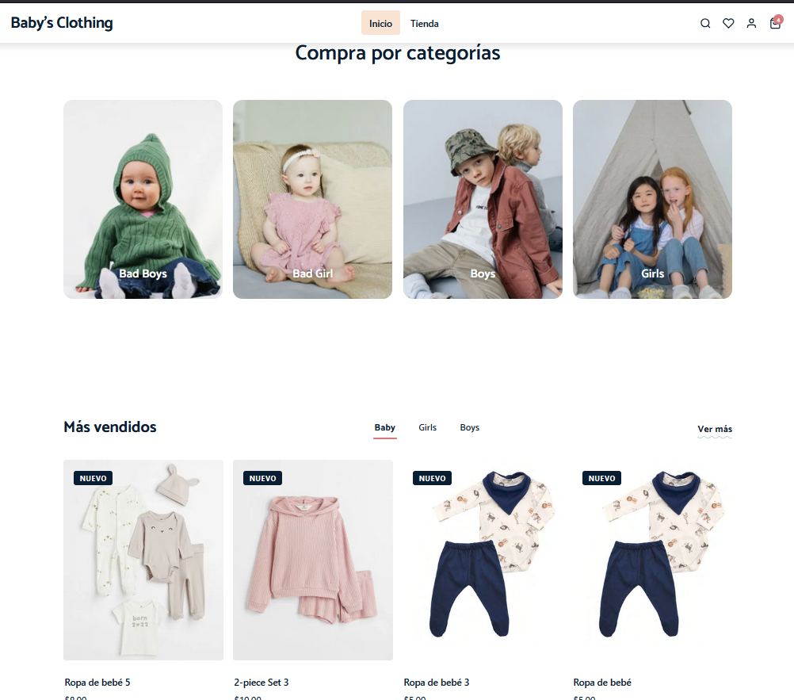
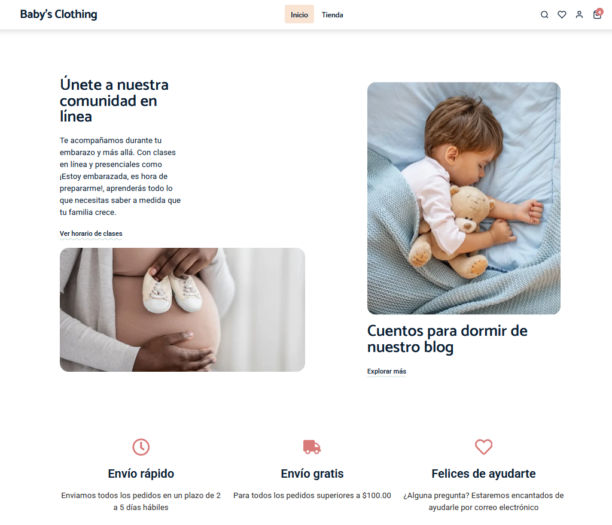
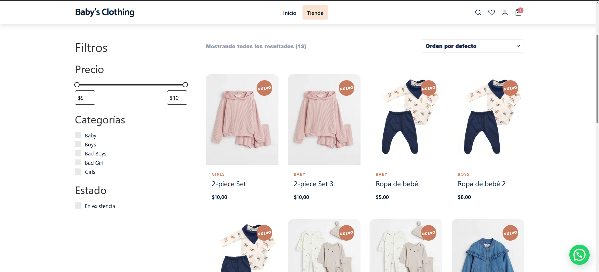
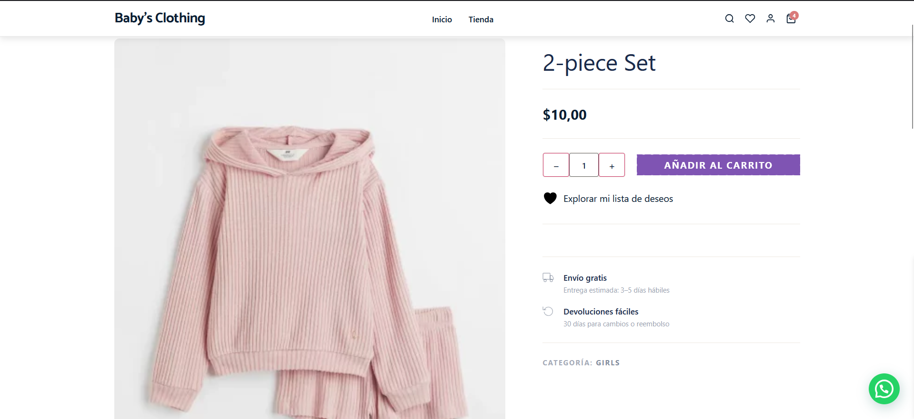
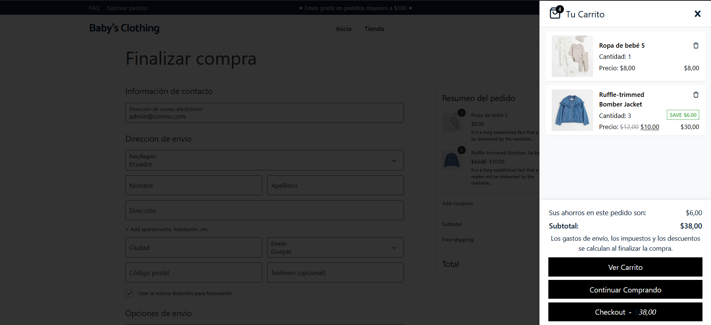

<div align="center">

# 👗 WP Clothing

### Tienda de moda online construida con WordPress, WooCommerce y Elementor.<br/>Tema hijo personalizado con SASS modular, shortcodes propios, animaciones de scroll y diseño minimalista.

<br/>


</div>

---

## 📋 Descripción

**WP Clothing** es una tienda de ropa online desarrollada sobre WordPress + WooCommerce. Utiliza un tema hijo de **Hello Elementor** con un sistema de estilos SASS completamente modular (BEM), shortcodes personalizados para las secciones clave del home, animaciones de scroll con Intersection Observer, y un footer 100% administrable desde el Customizer y los Menús de WordPress.

---

## 📸 Capturas de pantalla

### 🏠 Página principal

<div align="center">
  
  
  
</div>

### 🛍️ Tienda

<div align="center">
  
</div>

### 📦 Detalle de producto

<div align="center">
  
</div>

### 🛒 Carrito y Checkout

<div align="center">
  
</div>

> **Nota:** Añadir las capturas en `docs/screenshots/` con los nombres indicados.

---

## ✨ Características

### Tienda

* 🛍️ **WooCommerce** — catálogo completo con carrito, checkout y página de producto
* 🔄 **Actualización de carrito vía AJAX** — fragmento con conteo dinámico sin recarga
* 🖼️ **Tamaños de imagen personalizados** — hero (1920×900), categoría (600×750), producto (600×750), banner (900×600)
* 📦 **12 productos por página**, 4 columnas en grid de tienda
* 🏷️ **Badges de oferta** — un único badge limpio sin duplicados, gestionado en la galería del producto
* ❤️ **Lista de deseos YITH** — botón integrado en la ficha de producto sin duplicados

### Tema hijo (Hello Elementor)

* ⚡ **Elementor** como constructor de páginas sin restricciones de layout
* 🎨 **Paleta de colores** — rosa suave, crema cálido, menta, casi-negro — todo centralizado en variables SASS
* 🔤 **Tipografía** — *Catamaran* vía Google Fonts
* 📱 **Responsive** — breakpoints móvil / tablet / escritorio en todos los componentes
* ✨ **Animaciones de scroll** — `fade-up`, `fade-right`, `fade-left`, `zoom-in` con Intersection Observer nativo; respeta `prefers-reduced-motion`

### Shortcodes personalizados

| Shortcode | Descripción |
|---|---|
| `[wpc_hero_slider]` | Carrusel hero con Swiper.js, slides configurables vía filtro |
| `[wpc_category_grid]` | Grid de categorías WooCommerce con imagen, nombre y CTA |
| `[wpc_product_tabs]` | Tabs de productos con carrusel Swiper por categoría |

### Footer administrable

* 4 columnas: **Logo + descripción**, **Tienda**, **Información**, **Contacto**
* Íconos de redes sociales SVG inline (Instagram, Facebook, TikTok, Pinterest, Twitter/X, YouTube)
* Links por columna gestionados desde `Apariencia › Menús`
* Textos, email y redes sociales editables desde `Apariencia › Personalizar › Footer`
* Barra inferior con copyright y links legales

---

## 🏗️ Stack tecnológico

| Capa | Tecnología |
|---|---|
| CMS | **WordPress 6.x** |
| Ecommerce | **WooCommerce 9.x** |
| Constructor | **Elementor** (tema base: Hello Elementor) |
| Backend | **PHP 8.x** |
| Estilos | **SASS** (estructura 7-1 simplificada, metodología BEM) |
| Animaciones | **Intersection Observer API** (nativo, sin librerías) |
| Carrusel | **Swiper.js 11** |
| Tipografía | **Google Fonts** — Catamaran |
| Build | **npm** + `sass` CLI |

---

## 🔌 Plugins instalados

| Plugin | Función |
|---|---|
| **WooCommerce** | Motor de tienda: productos, carrito, checkout, pedidos |
| **Elementor** | Constructor de páginas visual |
| **Hello Elementor** | Tema padre mínimo (~5 KB CSS) |
| **YITH WooCommerce Wishlist** | Lista de deseos integrada en la ficha de producto |
| **YITH WooCommerce Quick View** | Vista rápida de producto en modal |
| **WooCommerce Variation Swatches** | Tallas y colores como botones visuales |
| **Side Cart WooCommerce** | Carrito lateral deslizante |
| **Akismet** | Protección anti-spam |

---

## 🗂️ Estructura del tema

```
wp-clothing-theme/
├── assets/
│   ├── css/          ← CSS compilado (main.css)
│   ├── js/           ← main.js (Swiper, header sticky, scroll-reveal…)
│   └── images/
├── inc/
│   ├── class-nav-walker.php
│   └── shortcodes/
│       ├── hero-slider.php
│       ├── category-grid.php
│       └── product-tabs.php
├── sass/
│   ├── abstracts/    ← _variables, _mixins, _functions
│   ├── base/         ← _reset, _typography, _root
│   ├── components/   ← _hero, _buttons, _product-card, _banner, _category-grid…
│   ├── layout/       ← _header, _footer, _grid
│   ├── pages/        ← _home, _shop, _product, _cart, _checkout
│   ├── utilities/    ← _spacing, _colors
│   └── main.scss     ← Punto de entrada
├── woocommerce/
│   ├── single-product/
│   │   ├── product-image.php  ← Galería con thumbnails verticales
│   │   ├── related.php
│   │   └── add-to-cart/
│   │       └── simple.php     ← Qty + CTA + wishlist
│   └── content-product.php    ← Tarjeta de producto en catálogo
├── footer.php
├── functions.php
├── header.php
├── style.css
└── package.json
```

---

## 🎨 Variables SASS principales

```scss
// Paleta
$color-primary:      #f4a5a5;  // Rosa suave
$color-secondary:    #f9e4d4;  // Crema cálido
$color-accent:       #c8e6c9;  // Menta
$color-dark:         #2d2d2d;  // Titulares / Footer
$color-sale:         #e05252;  // Badge de oferta

// Tipografía
$font-heading: 'Catamaran', sans-serif;
$font-body:    'Catamaran', sans-serif;

// Breakpoints
$bp-sm: 640px;  $bp-md: 768px;
$bp-lg: 1024px; $bp-xl: 1280px;
```

---

## 🚀 Instalación local

**Requisitos:** Laragon (o XAMPP/WAMP), PHP 8.x, Node.js 18+

```bash
# 1. Clonar dentro de la carpeta www de Laragon
git clone <repo-url> wp-clothing
cd wp-clothing

# 2. Importar la base de datos
# (usa el archivo .sql si se incluye en /database)

# 3. Copiar wp-config de ejemplo y configurar
cp wp-config-sample.php wp-config.php
# Editar: DB_NAME, DB_USER, DB_PASSWORD, DB_HOST

# 4. Ir al tema e instalar dependencias de SASS
cd wp-content/themes/wp-clothing-theme
npm install

# 5. Compilar estilos
npm run sass

# 6. Para desarrollo con watch
npm run sass:dev
```

---

## ⚙️ Scripts npm

```bash
npm run sass        # Compila (comprimido, sin source map) → assets/css/main.css
npm run sass:dev    # Watch con source maps para desarrollo
npm run sass:build  # Alias de sass (producción)
```

---

## 🗓️ Estado del proyecto

| Módulo | Estado |
|---|---|
| Tema base + variables SASS | ✅ Listo |
| Header responsive + top bar | ✅ Listo |
| Footer 4 columnas + social | ✅ Listo |
| Hero slider (Swiper.js) | ✅ Listo |
| Grid de categorías con animaciones | ✅ Listo |
| Tabs de productos con carrusel | ✅ Listo |
| Página de tienda (shop) | ✅ Listo |
| Página de producto con galería | ✅ Listo |
| Carrito lateral + Checkout | ✅ Listo |
| Lista de deseos (YITH) | ✅ Listo |
| Quick View (YITH) | ✅ Listo |
| Animaciones de scroll (Intersection Observer) | ✅ Listo |
| Badges de oferta sin duplicados | ✅ Listo |
| Demo online | ⏳ Pendiente |

---

## 👤 Autor

**Marlon Barzola**
- GitHub: [@MarlonBarzola](https://github.com/MarlonBarzola)
- LinkedIn: [Marlon Barzola](https://www.linkedin.com/in/marlon-barzola-756a8b154/)

---

## 📄 Licencia

Este proyecto es de uso personal/portafolio. Todos los derechos reservados.

---

<div align="center">

**Desarrollado con ❤️ usando WordPress + WooCommerce + SASS**

</div>


<br/>


</div>

---

## 📋 Descripción

**WP Clothing** es una tienda de ropa online desarrollada sobre WordPress + WooCommerce. Utiliza un tema hijo de **Hello Elementor** con un sistema de estilos SASS completamente modular (BEM), shortcodes personalizados para secciones clave del home, y un footer 100% administrable desde el Customizer y los Menús de WordPress.

El objetivo es un diseño ecommerce moderno y minimalista, fácil de mantener y reutilizable en futuros proyectos similares.

---

## ✨ Características

### Tienda

* 🛍️ **WooCommerce** — catálogo completo con carrito, checkout y página de producto
* 🔄 **Actualización de carrito vía AJAX** — fragmento con conteo dinámico sin recarga
* 🖼️ **Tamaños de imagen personalizados** — hero (1920×900), categoría (600×750), producto (600×750), banner (900×600)
* 📦 **12 productos por página**, 4 columnas en grid de tienda

### Tema hijo (Hello Elementor)

* ⚡ **Elementor** como constructor de páginas sin restricciones de layout
* 🎨 **Paleta de colores** — rosa suave, crema cálido, menta, casi-negro — todo centralizado en variables SASS
* 🔤 **Tipografía** — *Playfair Display* (titulares) + *Nunito* (cuerpo) vía Google Fonts
* 📱 **Responsive** — breakpoints móvil / tablet / escritorio en todos los componentes

### Shortcodes personalizados

| Shortcode | Descripción |
|---|---|
| `[wpc_hero_slider]` | Carrusel hero con Swiper.js |
| `[wpc_category_grid]` | Grid de categorías WooCommerce |
| `[wpc_product_tabs]` | Tabs de productos (Nuevos, Ofertas, Destacados) |

### Footer administrable

* 4 columnas: **Logo + descripción**, **Tienda**, **Información**, **Contacto**
* Íconos de redes sociales SVG inline (Instagram, Facebook, TikTok, Pinterest, Twitter/X, YouTube)
* Links por columna gestionados desde `Apariencia › Menús`
* Textos, email y redes sociales editables desde `Apariencia › Personalizar › Footer`
* Barra inferior con copyright y links legales

---

## 🏗️ Stack tecnológico

| Capa | Tecnología |
|---|---|
| CMS | **WordPress 6.x** |
| Ecommerce | **WooCommerce 9.x** |
| Constructor | **Elementor** (tema base: Hello Elementor) |
| Backend | **PHP 8.x** |
| Estilos | **SASS** (estructura 7-1 simplificada, metodología BEM) |
| Carrusel | **Swiper.js 11** |
| Tipografía | **Google Fonts** — Playfair Display + Nunito |
| Build | **npm** + `sass` CLI |

---

## 🗂️ Estructura del tema

```
wp-clothing-theme/
├── assets/
│   ├── css/          ← CSS compilado (main.css)
│   ├── js/           ← Scripts
│   └── images/
├── inc/
│   ├── class-nav-walker.php
│   └── shortcodes/
│       ├── hero-slider.php
│       ├── category-grid.php
│       └── product-tabs.php
├── sass/
│   ├── abstracts/    ← _variables, _mixins, _functions
│   ├── base/         ← _reset, _typography, _root
│   ├── components/   ← _hero, _buttons, _product-card, _banner…
│   ├── layout/       ← _header, _footer, _grid
│   ├── pages/        ← _home, _shop, _product, _cart, _checkout
│   ├── utilities/    ← _spacing, _colors
│   └── main.scss     ← Punto de entrada
├── footer.php
├── functions.php
├── header.php
├── style.css
└── package.json
```

---

## 🎨 Variables SASS principales

```scss
// Paleta
$color-primary:      #f4a5a5;  // Rosa suave
$color-secondary:    #f9e4d4;  // Crema cálido
$color-accent:       #c8e6c9;  // Menta
$color-dark:         #2d2d2d;  // Titulares / Footer

// Tipografía
$font-heading: 'Playfair Display', Georgia, serif;
$font-body:    'Nunito', 'Helvetica Neue', Arial, sans-serif;

// Breakpoints
$bp-sm: 640px;  $bp-md: 768px;
$bp-lg: 1024px; $bp-xl: 1280px;
```

---

## 🚀 Instalación local

**Requisitos:** Laragon (o XAMPP/WAMP), PHP 8.x, Node.js 18+

```bash
# 1. Clonar dentro de la carpeta www de Laragon
git clone <repo-url> wp-clothing
cd wp-clothing

# 2. Importar la base de datos
# (usa el archivo .sql incluido en /database si existe)

# 3. Copiar wp-config de ejemplo y configurar
cp wp-config-sample.php wp-config.php
# Editar: DB_NAME, DB_USER, DB_PASSWORD, DB_HOST

# 4. Ir al tema e instalar dependencias de SASS
cd wp-content/themes/wp-clothing-theme
npm install

# 5. Compilar estilos
npm run sass

# 6. Para desarrollo con watch
npm run sass:dev
```

---

## ⚙️ Scripts npm

```bash
npm run sass        # Compila (comprimido, sin source map) → assets/css/main.css
npm run sass:dev    # Watch con source maps para desarrollo
npm run sass:build  # Alias de sass (producción)
```

---

##  Autor

**Marlon Barzola**
- GitHub: [@MarlonBarzola](https://github.com/MarlonBarzola)
- LinkedIn: [Marlon Barzola](https://www.linkedin.com/in/marlon-barzola-756a8b154/)

---

## 📄 Licencia

Este proyecto es de uso personal/portafolio. Todos los derechos reservados.

---

<div align="center">

**Desarrollado con ❤️ usando WordPress + WooCommerce + SASS**

</div>
